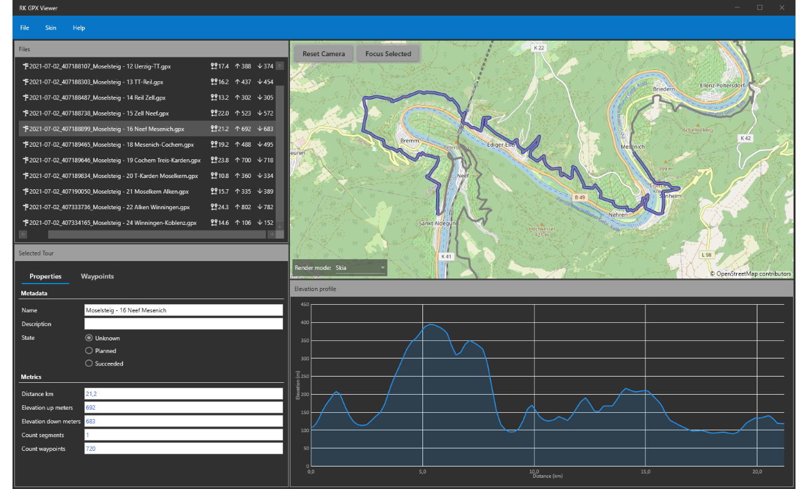
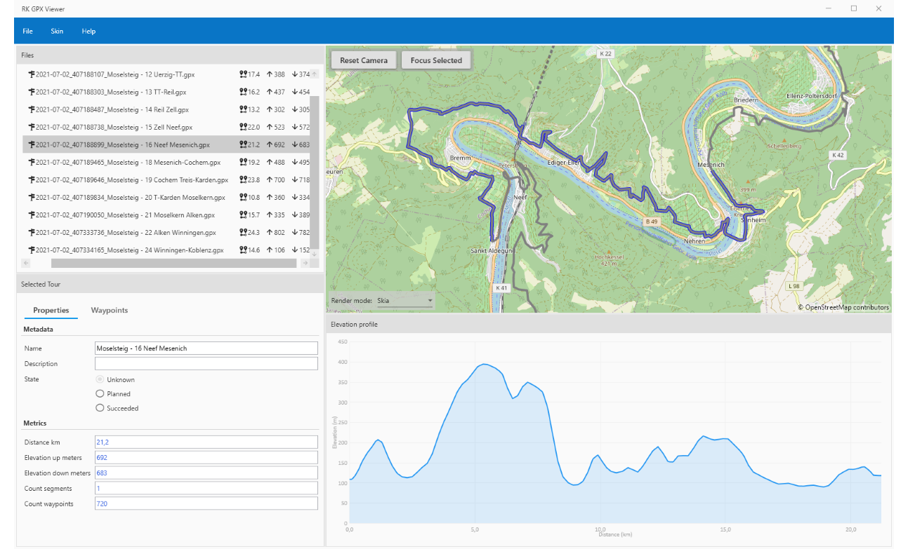

# GpxViewer 
## About
GpxViewer is an application to view .gpx (GPS Exchange Format) files. I started
developing it in preparation for a tour over the alps in summer 2021. Beside of that for me the
tool was also an experimental project for good modular design of a monolithic desktop application.

## Screenshots

## Project is based on...
GpxViewer is based on .Net 5 and WPF, therefore it is Windows-only.

Furthermore the project is based on following technologies / projects:
 - [Prism](https://github.com/PrismLibrary/Prism): Prism is a framework for building loosely coupled, maintainable, and testable XAML applications in WPF, Xamarin Forms, and Uno / Win UI Applications
 - [Mapsui](https://github.com/Mapsui/Mapsui): Mapsui is a .NET Map component for WPF, Xamarin.Forms, Xamarin.Android, Xamarin.iOS and UWP
 - [Live-Charts](https://github.com/Live-Charts/Live-Charts): Simple, flexible, interactive & powerful charts, maps and gauges for .Net
 - [MaterialDesignInXaml](https://github.com/MaterialDesignInXAML/MaterialDesignInXamlToolkit): Google's Material Design in XAML & WPF, for C# & VB.Net
 - [Json.NET](https://www.newtonsoft.com/json): Popular high-performance JSON framework for .NET
 - [FirLib](https://github.com/RolandKoenig/FirLib): Utility library for most of my own open source applications